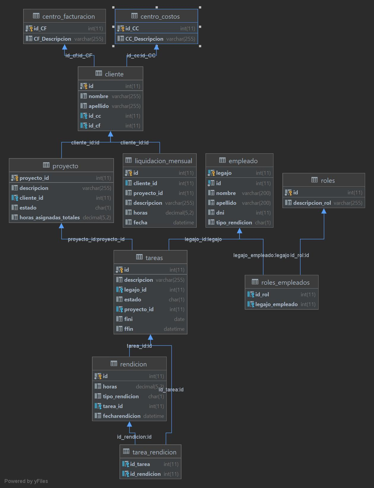

# Trabajo Práctico - Fase 1

Se necesita implementar una aplicación se seguimiento de proyectos, focalizado en la gestión de las personas participantes del mismo.

Al estar encargados de la creación y mantenimiento de la base de datos, como así también del desarrollo de la lógica de datos, se debe crear un modelo de datos, y proponer algunos puntos de acceso como stored procedures, y tener en cuenta restricciones de seguridad, rendimiento, etc.

## Fase 1 - Entrega 20/9/2021

Conceptos/Entidades a tener en cuenta para diseñar la solución:

Participante del proyecto. Es una persona, con un legajo ya existente en el sistema de RRHH, que tiene una asignación de horas mensuales a un proyecto. Los participantes del proyecto pueden tener distintos roles (por ejemplo Project Manager, Desarrollador, Tester, Administrador, DevOps, …), que pueden ser variables.

Rendición de horas: Cada usuario puede rendir las horas trabajadas diariamente a los proyectos en los que esté involucrada. Como se relevó, hay casos que no presentan variabilidad respecto a la carga, por lo que se pueden proveer distintos modelos para rendir horas: 

cantidad de horas en un día

cantidad fija de horas semanalmente (en una semana determinada)

cantidad fija de horas mensualmente (en un mes dado)

Los proyectos están asociados a un único cliente, que va a tener asignado un centro de costos y un centro de facturación.

Cuando sea requerido, usuarios específicos pueden pedir una liquidación mensual de horas por cliente y proyecto. Esta liquidación mensual debe guardarse en una tabla separada, ya que si alguien modifica asignación de horas del pasado, lo ya liquidado, no puede cambiar.

Dado el ejemplo anterior, y también a pedido de ciertos usuarios, deberá haber un procedimiento de ajuste de horas cargadas a la fecha respecto a las liquidaciones hechas en lo que va del año. Este procedimiento generará una nueva liquidación relacionada a la original para ese mes sólamente con la diferencia entre lo ya liquidado y las horas asignadas. Por ejemplo, si para un proyecto se modifican cargas en un mes ya liquidado, se generará una liquidación que registre esa diferencia.

### Modelo Relacional

Se debe entregar en un repositorio de GitHub:

Creación del esquema de base de datos diseñado (en la carpeta DDL)

Stored Procedures: RendicionDeHoras (puede ser uno que permita los distintos tipos de ingreso o uno por cada tipo de carga) y CalcularLiquidacionMensual. Ambos deben estar en la carpeta desarrollo.

Scripts de prueba. Se requiere que en una carpeta de tests se realicen las siguientes tareas:

Generar datos

Ejecutar los distintos Stored Procedures

Comparar los datos que quedan guardados en la base de datos con lo que debería haber

Todas las acciones deben quedar en el branch develop - pueden usarse branches intermedios para trabajar.

